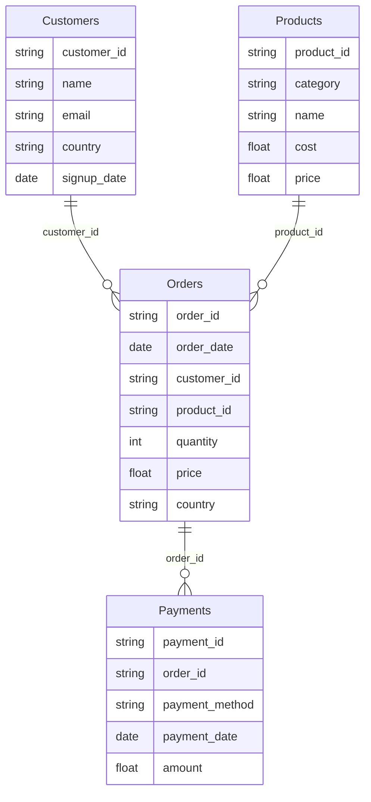

# 🚀 Data Engineering Portfolio — Cloud Pipeline (Python, SQL, GCP, Spark, Airflow, Power BI)

## Table of Contents

- [📌 Overview](#📌-overview)
- [🗺️ Global Architecture](#🗺️-global-architecture)
- [🏗️ Project Structure](#🏗️-project-structure)
- [🧱 Pipeline Step-by-Step](#🧱-pipeline-step-by-step)
- [📓 Exploration Notebook](#📓-exploration-notebook)
- [⚙️ Orchestration](#⚙️-orchestration)
- [🔧 Technologies Used](#🔧-technologies-used)
- [🔐 Configuration Variables](#🔐-configuration-variables)
- [📊 Data Schemas](#📊-data-schemas)

## 📌 Overview

This project is a **complete data pipeline**, designed to showcase professional **Data Engineering** skills, including:
-   Generation of raw fake data (Faker)
-   Local storage in Parquet and upload to **Google Cloud Storage (GCS)**
-   Distributed analytics with **Apache Spark**
-   Final storage in **BigQuery** (`processed_data` dataset)
-   Visualization with **Power BI** (dashboard included)
-   Optional orchestration via **Airflow** (DAG provided)
    
It implements a modern architecture close to production cloud pipelines.

> ⚠️ Important  
> This repository does **not include credentials** for accessing GCS or BigQuery.  
> To run the full pipeline (`python -m src.scripts.main`), you need to provide your own credentials and configure `src/config/constants.py`.  
> The static Power BI file `dashboard_static/portfolio_static.pbix` can be opened directly **without credentials**.


## 🗺️ Global Architecture
```
            ┌─────────────────────────┐
            │        Data Faker       │
            └───────┬─────────────────┘
                    │ Parquet
                    ▼
            ┌─────────────────────────┐
            │      Local Storage      │
            └───────┬─────────────────┘
                    │ Upload
                    ▼
            ┌────────────────────────┐
            │  Google Cloud Storage  │
            └───────┬────────────────┘
                    │ Input Parquet
                    ▼
            ┌─────────────────────────┐
            │      Apache Spark       │
            └───────┬─────────────────┘
                    │ Output Parquet
                    ▼
            ┌─────────────────────────┐
            │         BigQuery        │
            └───────┬─────────────────┘
                    │ Direct Query
                    ▼
            ┌─────────────────────────┐
            │        Power BI         │
            └─────────────────────────┘
```

----------
## 🏗️ Project Structure
```
data_engineering_portfolio/
│
├── dashboard/
│   └── portfolio_static.pbix # Power BI report
│
├── data/
│   └── raw/
│       └── <table_name>/run_date=YYYY-MM-DD/*.parquet
│
├── jars/
│   └── gcs-connector-hadoop3-latest.jar
│
├── keys/
│   └── service_account.json # (ignored in git)
│
├── logs/
│   └── log_run_date=YYYY-MM-DD.log
│
├── src/
│   ├── config/
│   │   ├── runtime_config.py # Variables set via CLI arguments
│   │   └── constants.py # Global project constants
│   ├── dag/
│   │   └── data_pipeline_dag.py # Airflow DAG (optional)
│   ├── notebook/
│   │   └── exploration.ipynb # Interactive exploration
│   ├── scripts/
│   │   ├── step1_raw_data_generation.py
│   │   ├── step2_gcs_ingestion.py
│   │   ├── step3_spark_processing.py
│   │   ├── step4_big_query_loading.py
│   │   ├── step5_big_query_validation.py
│   │   ├── logger.py
│   │   └── main.py # Local orchestration
│   └── utils/
│       └── utils_bq.py
│
└── README.md` 
```
----------


## 🧱 Pipeline Step-by-Step

### 1️⃣ Fake Data Generation

Script: `step1_raw_data_generation.py`

Generates 4 Parquet tables (one folder per table, one subfolder per date):
-   `customers`
-   `products`
-   `orders`
-   `payments`
    
Each file is stored at:  
`data/raw/<table_name>/run_date=YYYY-MM-DD/<table_name>.parquet`
> Data is realistic and consistent (Faker + business rules).

----------

### 2️⃣ Upload to Google Cloud Storage

Script: `step2_gcs_ingestion.py`

Uploads generated files to GCS, using the bucket defined in `constants.py`:  
`gs://<bucket>/raw/<table_name>/run_date=YYYY-MM-DD/*.parquet`

----------


### 3️⃣ Processing with Apache Spark

Script: `step3_spark_processing.py`

Spark reads the files from GCS, cleans them, and generates 5 transformed tables:
-   **orders_enriched** : joins customers + products, computes total amount
-   **customers_revenue** : total revenue per customer
-   **products_sales** : quantity sold + revenue per product
-   **category_revenue** : revenue per category
-   **payments_summary** : total revenue + count per payment method
    
All outputs are written to:  
`gs://<bucket>/processed/<table_name>/run_date=YYYY-MM-DD/*.parquet`

----------


### 4️⃣ Load into BigQuery

Script: `step4_bigquery_loading.py`

-   Creates `processed_data` dataset automatically
-   Corrects `category_revenue` schema automatically

----------


### 5️⃣ Data Validation in BigQuery

Script: `step5_bigquery_validation.py`

Validates data quality and consistency:
-   **Completeness checks**: row count, presence of key columns
-   **Consistency checks**:
    -   `category_revenue` matches sum of product sales per category
    -   `customers_revenue` matches sum of orders in `orders_enriched`   
-   **Type/format checks**: numeric columns are `FLOAT64`, dates correctly formatted
-   **Anomaly reporting**: logs discrepancies or unexpected values

Ensures visualizations and analyses use correct data.

----------


### 6️⃣ Power BI Visualization

📁 `dashboard/portfolio_static.pbix`

Static Power BI dashboard:
-   Data imported from BigQuery at the time of PBIX creation
-   File is **no longer connected** to BigQuery, no credentials needed
-   Shareable safely **without generating extra BigQuery costs**
    
Visualizations include:
-   Total revenue per customer
-   Sales by category
-   Product analysis: quantity & revenue
-   Payment methods
-   Detailed enriched transactions
-   Etc.

----------

## 📓 Exploration Notebook

`src/notebook/exploration.ipynb` allows:

-   Raw data exploration
-   Parquet structure tests
-   Join quality validation
-   Manual Spark results inspection
-   Ad-hoc visualization preparation

Serves as a sandbox before pipeline implementation.

## ⚙️ Orchestration

### ▶️ Local Orchestrated Mode

Run the full pipeline from the project root:
`python -m src.scripts.main` 

Executes in order:
1. `step1_raw_data_generation.py`,
2. `step2_gcs_ingestion.py`,
3. `step3_spark_processing.py`,
4. `step4_bigquery_loading.py`,
5. `step5_bigquery_validation.py`

----------


### 🧩 Available Parameters

`main.py` accepts two optional CLI arguments:

-   **`--run_date YYYY-MM-DD`**
	-   Sets logical execution date of the pipeline
    -   Defaults to `constants.py` if not provided
    - **Example :** `python -m src.scripts.main --run_date 2025-12-01` 
- **`--verbose`**
	-   Enables detailed console output
	-   Useful for local debugging
	- **Example :** `python -m src.scripts.main --verbose`

**Full example:** `python -m src.scripts.main --run_date 2025-12-01 --verbose`

----------

### 🌀 Airflow Mode (optional)

DAG available at:  
`src/dag/data_pipeline_dag.py`  

Executes exactly the same 5 pipeline steps.

----------

## 🔧 Technologies Utilisées

| Domain        | Tools / Libraries |
|----------------|------------------|
| **Language**    | Python (Faker, pandas, pathlib) and SQL |
| **Cloud**      | Google Cloud Storage, BigQuery |
| **Processing** | Apache Spark + GCS Connector |
| **Visualization** | Power BI |
| **Orchestration** | Python CLI, Airflow (optional) |
| **Format** | Parquet (optimized for analytics) |

----------
## 🔐 Configuration Variables

`src/config/constants.py` contains:
-   Local paths
-   GCS bucket
-   BigQuery dataset name
-   Spark GCS connector path
-   List of raw/processed tables
-   Path to service account key
    
> ⚠️ The service account is stored in `/keys/` but **ignored by Git** for security.

----------

## 📊 Data Schemas

### GCS (raw)




### BigQuery (processed)

```mermaid
erDiagram
	Payments_Summary {
        string payment_method
        float total_amount
        int total_count
    }

	Product_Sales {
        string product_id
        string product_name
        string category
        float total_quantity_sold
        float total_revenue
    }

	Orders_Enriched {
        string order_id
        date order_date
        string customer_id
        string customer_name
        string email
        string customer_country
        date signup_date

        string product_id
        string product_name
        string category
        float cost
        float price

        float order_quantity
        float order_price
        string order_country

        float total_amount
    }

	 Customer_Revenue {
        string customer_id
        string customer_name
        float total_revenue
    }

	Category_Revenue {
        string category
        float category_revenue
    }

    Orders_Enriched ||--o{ Customer_Revenue : "customer_id"
    Orders_Enriched ||--o{ Product_Sales : "product_id"
    Orders_Enriched ||--o{ Category_Revenue : "category"
   ``

----------