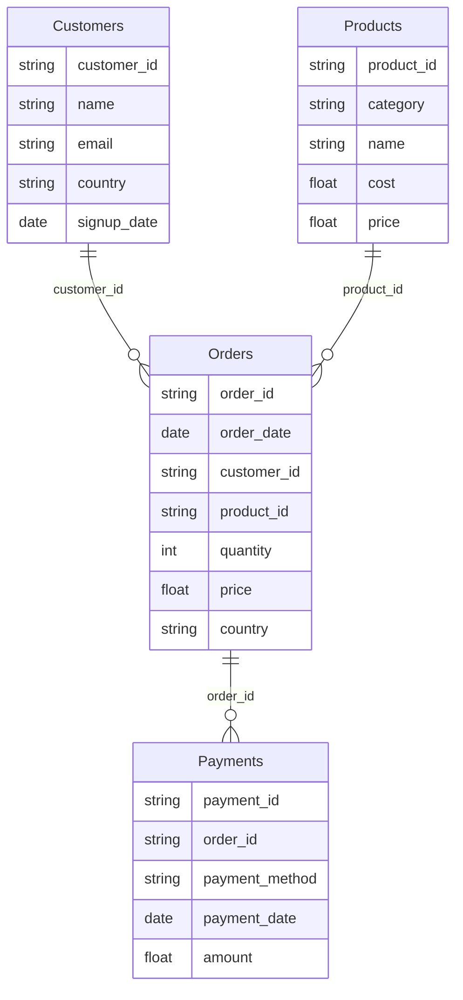

# 🚀 Data Engineering Portfolio — Pipeline Cloud (Python, SQL, GCP, BigQuery, Spark, Airflow, Docker, Power BI)

## Sommaire

- [📌 Présentation](#📌-présentation)
- [🗺️ Architecture Globale](#🗺️-architecture-globale)
- [🏗️ Structure du Projet](#🏗️-structure-du-projet)
- [🧱 Pipeline Step-by-Step](#🧱-pipeline-step-by-step)
- [📓 Notebook d’Exploration](#📓-notebook-dexploration)
- [⚙️ Orchestration (4 modes)](#⚙️-orchestration-4-modes)
- [🔧 Technologies Utilisées](#🔧-technologies-utilisées)
- [🔐 Variables de configuration](#🔐-variables-de-configuration)
- [📊 Schémas de données](#📊-schémas-de-données)

## 📌 Présentation

Ce projet constitue un **pipeline data complet**, entièrement conçu pour démontrer des compétences professionnelles en **Data Engineering**, incluant :
-   Génération de données brutes factices (Faker)
-   Stockage local en Parquet puis Upload vers **Google Cloud Storage (GCS)**
-   Traitement analytique distribué avec **Apache Spark**
-   Stockage final dans **BigQuery** (dataset `processed_data`)
-   Visualisation sur **Power BI** (dashboard inclus)
-   Gestion de l’orchestration possible via **Airflow** (DAG fourni mais optionnel)

Il s’agit d’une architecture moderne, proche des pipelines utilisés dans les environnements cloud production.

> ⚠️ Important
> Ce dépôt ne contient pas de credentials pour accéder à GCS ou BigQuery. 
> Pour exécuter le pipeline complet (`python -m src.scripts.main`), vous devez fournir vos propres credentials et configurer `src/config/constants.py`
> Le fichier Power BI statique `dashboard_static/portfolio_static.pbix` peut être consulté directement sans credentials.


## 🗺️ Architecture Globale
```
            ┌─────────────────────────┐
            │        Data Faker       │
            └───────┬─────────────────┘
                    │ Parquet
                    ▼
            ┌─────────────────────────┐
            │      Local Storage      │
            └───────┬─────────────────┘
                    │ Upload
                    ▼
            ┌────────────────────────┐
            │  Google Cloud Storage  │
            └───────┬────────────────┘
                    │ Input Parquet
                    ▼
            ┌─────────────────────────┐
            │      Apache Spark       │
            └───────┬─────────────────┘
                    │ Output Parquet
                    ▼
            ┌─────────────────────────┐
            │         BigQuery        │
            └───────┬─────────────────┘
                    │ Direct Query
                    ▼
            ┌─────────────────────────┐
            │        Power BI         │
            └─────────────────────────┘
```

----------
## 🏗️ Structure du Projet
```
data_engineering_portfolio/
│
├── dashboard/
│   └── portfolio_static.pbix # Rapport Power BI
│
├── data/
│   └── raw/
│       └── <table_name>/run_date=YYYY-MM-DD/*.parquet
│
├── jars/
│   └── gcs-connector-hadoop3-latest.jar
│
├── keys/
│   └── service_account.json # (Ignoré dans git)
│
├── logs/
│   └── log_run_date=YYYY-MM-DD.log
│
├── src/
│   ├── config/
│   │   ├── runtime_config.py # Variables définies via les arguments CLI
│   │   └── constants.py # Variables globales du projet
│   ├── dag/
│   │   └── data_pipeline_dag.py # DAG Airflow (optionnel)
│   ├── notebook/
│   │   └── exploration.ipynb # Analyses et tests interactifs
│   ├── scripts/
│   │   ├── step1_raw_data_generation.py
│   │   ├── step2_gcs_ingestion.py
│   │   ├── step3_spark_processing.py
│   │   ├── step4_big_query_loading.py
│   │   ├── step5_big_query_validation.py
│   │   ├── logger.py
│   │   └── main.py # Orchestration locale
│   └── utils/
│       └── utils_bq.py
│
├── Dockerfile
├── requirements.txt
└── README.md` 
```
----------

## 🧱 Pipeline Step-by-Step

### 1️⃣ Génération de données factices

Script : `step1_raw_data_generation.py`

4 tables sont générées sous forme de Parquet (un dossier par table + un dossier par date) :
-   `customers`
-   `products`
-   `orders`
-   `payments`

Chaque fichier est stocké dans :
`data/raw/<table_name>/run_date=YYYY-MM-DD/<table_name>.parquet` 
> Les données sont réalistes et cohérentes (Faker + règles métier).
----------

### 2️⃣ Upload vers Google Cloud Storage

Script : `step2_gcs_ingestion.py`

Les fichiers générés sont envoyés dans GCS, dans le bucket défini dans `constants.py` :
`gs://<bucket>/raw/<table_name>/run_date=YYYY-MM-DD/*.parquet` 

----------

### 3️⃣ Traitements avec Apache Spark

Script : `step3_spark_processing.py`

Spark lit les fichiers depuis GCS, les nettoie et génère 5 tables transformées :
-   **orders_enriched**  : (jointure clients + produits + calcul montant)
-   **customers_revenue** : (CA par client)
-   **products_sales** : (quantité + revenu par produit)
-   **category_revenue** : (CA par catégorie)
-   **payments_summary** : (CA + nombre par moyen de paiement)
    
Toutes les sorties sont écrites vers :
`gs://<bucket>/processed/<table_name>/run_date=YYYY-MM-DD/*.parquet` 

----------

### 4️⃣ Chargement dans BigQuery

Script : `step4_bigquery_loading.py`

- Dataset créé automatiquement : `processed_data` 
- Un nettoyage automatique est appliqué pour corriger le schéma de `category_revenue`.

----------

### 5️⃣ Validation des données dans BigQuery

Script : `step5_bigquery_validation.py`

Cette étape permet de **vérifier la qualité et la cohérence des données** après chargement :
-   **Contrôles de complétude** : nombre de lignes et présence des colonnes clés pour chaque table
-   **Contrôles de cohérence** :
    -   Vérification que `category_revenue` correspond bien à la somme des ventes des produits par catégorie
    -   Vérification du chiffre d’affaires total par client (`customers_revenue`) vs somme des commandes dans `orders_enriched`
-   **Contrôles de type et format** : s’assurer que les colonnes numériques sont bien de type `FLOAT64` et les dates correctement formatées
-   **Reporting d’anomalies** : génération d’un fichier log contenant les écarts ou valeurs inattendues

Cette étape permet d’éviter que des données incorrectes soient exploitées par la suite dans les visualisations ou analyses.

----------

### 6️⃣ Visualisation Power BI

📁 `dashboard/portfolio_static.pbix`

Le rapport Power BI est un **dashboard statique** :  
- Les données ont été importées depuis BigQuery au moment de la génération du PBIX.  
- Le fichier n’est **plus connecté à BigQuery**, aucun credential n’est nécessaire pour l’ouvrir.  
- Cela permet de partager le rapport sans risque d’accès non autorisé aux données et **sans générer de coûts supplémentaires** sur BigQuery.  

Le rapport présente différentes visualisations :
- CA total par client
- Répartition des ventes par catégorie
- Analyse produit : quantité vendue et revenu
- Méthodes de paiement
- Détails transactionnels enrichis
- etc...

----------

## 📓 Notebook d'Exploration

Le fichier `src/notebook/exploration.ipynb` permet :

- d'explorer les données raw
- de tester les structures Parquet
- de valider la qualité des joins
- d'explorer manuellement les résultats Spark
- de préparer des visualisations ad hoc

Ce notebook sert d’espace d’expérimentation avant l’implémentation dans le pipeline.

## ⚙️ Orchestration **(4 modes → CLI → Docker → Cloud Run → Airflow)**

**Même pipeline, 4 environnements** :

| Mode | Commande | Avantage | Temps | Coût |
|------|----------|----------|-------|------|
| **1. Local CLI** | `python -m src.scripts.main` | **Dev rapide** | **30s** | 0€ |
| **2. Docker** | `docker run ...` | **Reproductible** | **2min** | 0€ |
| **3. Cloud Run** | `gcloud run jobs execute` | **Serverless** | **5min** | **0.01€** |
| **4. Airflow** | `src/dag/data_pipeline_dag.py` | **Production** | Variable | Variable |


### 🧩 Paramètres disponibles

- **`--run_date YYYY-MM-DD`**
	-   Définit la date d'exécution logique du pipeline.
	-   Si non fournie, la valeur par défaut provient de `constants.py`.
	- **Exemple :** `python -m src.scripts.main --run_date 2026-01-01` 
- **`--verbose`**
	-   Active un mode détaillé d’affichage dans la console.
	-   Utile pour le debug local.
	- **Exemple :** `python -m src.scripts.main --verbose`

```bash
# CLI : arguments
python -m src.scripts.main --run_date 2026-01-01 --verbose

# Docker : env vars
docker run ... -e RUN_DATE=2026-01-01 -e VERBOSE=true

# Cloud Run : override
gcloud run jobs execute ... --update-env-vars="RUN_DATE=2026-01-01,VERBOSE=true"
```
----------

### 1️⃣ Local CLI

Une fois placé dans la racine du projet, le lancement du pipeline complet se fait via la commande :
`python -m src.scripts.main` 

Cela exécute successivement :
1. `step1_raw_data_generation.py`,
2. `step2_gcs_ingestion.py`,
3. `step3_spark_processing.py`,
4. `step4_bigquery_loading.py`,
5. `step5_bigquery_validation.py`

**Exemple complet :** 
```bash
python -m src.scripts.main --run_date 2026-01-01 --verbose
```
----------

### 2️⃣ Docker
```bash
docker build -t data-engineering-portfolio .
docker run --rm \
  -e GOOGLE_APPLICATION_CREDENTIALS=/app/keys/service_account.json \
  -e RUN_DATE=2026-01-01 -e VERBOSE=true \
  -v $(pwd)/keys:/app/keys \
  data-engineering-portfolio
```
----------

### 3️⃣ Cloud Run Jobs
```bash
# Créer (1x)
gcloud run jobs create data-engineering-pipeline-job \
  --image europe-west9-docker.pkg.dev/data-portfolio-sami/data-portfolio-repo/data-engineering-portfolio:latest \
  --region=europe-west9 \
  --set-env-vars="GCS_BUCKET_NAME=data-engineering-portfolio-bucket,BQ_DATASET_NAME=processed_data" \
  --memory=4Gi --cpu=2 --task-timeout=1800s

# Exécuter (N fois)
gcloud run jobs execute data-engineering-pipeline-job \
  --region=europe-west9 \
  --update-env-vars="RUN_DATE=2026-01-01,VERBOSE=true"
```
----------

### 4️⃣ Airflow

Un DAG Airflow est proposé dans :
`src/dag/data_pipeline_dag.py` 

Il reproduit exactement les 5 étapes du pipeline.

----------

### ⚡ Retour d'expérience & Debug

- 💥 **Out Of Memory Spark** : lors de la première exécution, le job Spark a planté sur Cloud Run car la mémoire par défaut (512 Mi) était trop faible. Ce problème a été résolu en passant le job à `--memory=4Gi --cpu=2`.
- ⏱️ **Cold start** : le démarrage initial (download image + lancement de Spark) prend plusieurs dizaines de secondes, ce qui est normal en environnement serverless.
- ✅ **Logs centralisés** : toutes les étapes du pipeline (step1 à step5) sont visibles en temps réel dans la console Cloud Run Jobs de GCP. Le pipeline est observable et déboguable depuis le cloud
- ✅ **12-Factor App** : même code exécuté dans 4 environnements (CLI local, Docker, Cloud Run Jobs, Airflow), uniquement configuré via arguments CLI et variables d’environnement.

----------

## 🔧 Technologies Utilisées

| Domaine        | Choix Techniques |
|----------------|------------------|
| **Langage**    | Python (Faker, pandas, pathlib) et SQL |
| **Cloud**      | Google Cloud Storage, BigQuery, Cloud Run Jobs, Artifact Registry |
| **Conteneur** | Docker |
| **Traitement** | Apache Spark + GCS Connector |
| **Visualisation** | Power BI |
| **Orchestration** | CLI, Docker, Cloud Run Jobs, Airflow |
| **Format** | Parquet (optimisé pour analyse) |

----------

## 🔐 Variables de configuration

Le fichier `src/config/constants.py` contient :

-   chemins locaux
-   bucket GCS
-   nom dataset BigQuery
-   chemin Spark GCS connector
-   liste des tables raw / processed
-   chemin vers la clé de service
> ⚠️ La clé de service est stockée dans `/keys/` mais **ignorée par Git** pour des raisons de sécurité.

----------

## 📊 Schémas de données 

### GCS (raw)




### BigQuery (processed)

```mermaid
erDiagram
	Payments_Summary {
        string payment_method
        float total_amount
        int total_count
    }

	Product_Sales {
        string product_id
        string product_name
        string category
        float total_quantity_sold
        float total_revenue
    }

	Orders_Enriched {
        string order_id
        date order_date
        string customer_id
        string customer_name
        string email
        string customer_country
        date signup_date

        string product_id
        string product_name
        string category
        float cost
        float price

        float order_quantity
        float order_price
        string order_country

        float total_amount
    }

	 Customer_Revenue {
        string customer_id
        string customer_name
        float total_revenue
    }

	Category_Revenue {
        string category
        float category_revenue
    }

    Orders_Enriched ||--o{ Customer_Revenue : "customer_id"
    Orders_Enriched ||--o{ Product_Sales : "product_id"
    Orders_Enriched ||--o{ Category_Revenue : "category"
   ````

----------